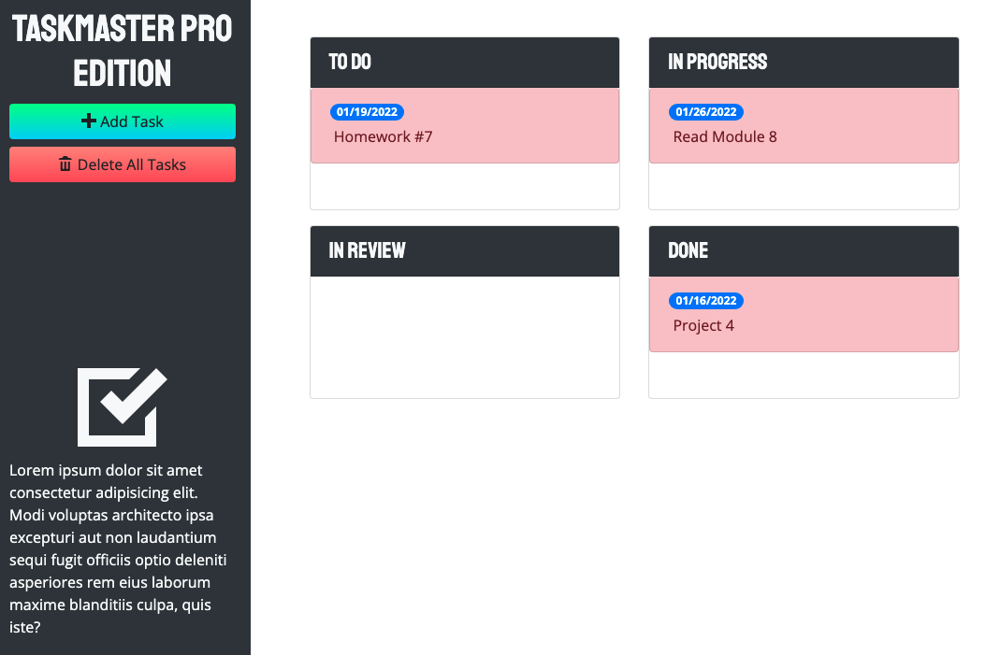

# Taskmaster Pro

## Description

Taskmaster Pro is a Kanban style application that allows the user to track and categorize tasks based off of their progress. The data is saved in local storage and the application makes use of multiple third-party APIs including bootstrap, jQuery, jQuery UI, and Moment.js

## Table of Contents

- [Installation](#Installation)
- [Usage](#Usage)
- [License](#License)
- [Questions](#Questions)

## Installation

Clone the repository to your local machine.

## Usage

From the root folder of this repository, open `index.html` and you will be directed to the Taskmaster Pro application. Your data will automatically be saved locally on your computer.

## License

A short and simple permissive license with conditions only requiring preservation of copyright and license notices. Licensed works, modifications, and larger works may be distributed under different terms and without source code.

## Questions

If you have any questions, concerns, or comments, feel free to contact me:

-GitHub: [Zacharycampanelli](https://github.com/Zacharycampanelli)  
-Email: [zaccamp@optonline.net](mailto:zaccamp@optonline.net)
